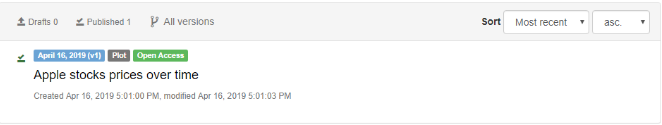

# Exercise no.03 - Register the output in Zenodo open-access repository

In this exercise we learn how to: 
* Get your Zenodo Access Token to deposit file in Zenodo.
* Create a new empty upload for your new file (plot image).
* Add some metadata to your file.
* Publish and check your file in Zenodo.

## Get your access token to access Zenodo open-access repository

* Register for a Zenodo account.
* If you don’t already have one create your personal account [here](https://sandbox.zenodo.org/account/settings/applications/tokens/new). 
* Create the Register with your GitHub/ORCID account.
* Go to [applications](https://sandbox.zenodo.org/account/settings/applications/) then click on "Personal access tokens" →  
  "+ New token" this will be your ZENODO_ACCESS_TOKEN.
* For the quick start tutorial you need the following Scopes: `deposit:write` and `deposit:actions`.

## Notes:

* For this training we will use the "Zenodo Sandbox" service available at: https://sandbox.zenodo.org/
* Make sure there are no uploads in https://sandbox.zenodo.org/deposit. 
* If there are you can delete them (unless you know what you're doing and have already uploaded files to be published).

## Hands-on:

### Create an empty upload

In the Docker container open the Python console shell and do the following:

<pre>
$ python
Python 2.7.12 (default, Nov 12 2018, 14:36:49) 
[GCC 5.4.0 20160609] on linux2
Type "help", "copyright", "credits" or "license" for more information.
>>> 

# Configuring settings
>>> import requests
>>> import json
>>> ZENODO_ACCESS_TOKEN = "ADD_YOUR_TOKEN_HERE"
>>> zenodo_uri = "https://sandbox.zenodo.org/api/deposit/depositions"
>>> response = requests.get(zenodo_uri, 
               params={'access_token': ZENODO_ACCESS_TOKEN})

>>> response.json()
>>> []
>>> response.status_code
200

# Create a new empty upload
>>> headers = {"Content-Type": "application/json"}  
>>> response = requests.post(zenodo_uri,
			params={'access_token': ZENODO_ACCESS_TOKEN}, 
			json={}, headers=headers)

>>> response.status_code
201
>>> response.json()
# Should return a whole bunch of stuff now

# Get the deposition_id
>>> deposition_id = response.json()['id']
>>> data = {'filename': 'YOUR_PLOT_FILE'}
>>> file = {'file': open('/path/to/yourplot', 'rb')}
>>> file_uri = "%s/%s/files" % (zenodo_uri, deposition_id)

>>> response = requests.post(file_uri, 
           params={'access_token': ZENODO_ACCESS_TOKEN},
           data=data, files=file)
>>> print response.json()
</pre>

### Add metadata to the file before upload

<pre>
>>> data = {
       'metadata': {
               'title': 'Apple stock prices over time',
			         'upload_type': 'image',              
 		           'image_type' : 'plot',
               'description': 'This is my first plot',                          
      
               'creators': [{                                 
                    'name': 'Giuseppe La Rocca',
                    'affiliation': 'EGI Foundation'                        
                }]
      }
}

>>> file_uri = "%s/%s" % (zenodo_uri, deposition_id)
>>> response = requests.put(file_uri,
			params={'access_token':ZENODO_ACCESS_TOKEN},
			data=json.dumps(data),
				    headers=headers)
>>> print response.json()
</pre>

### Publish entry in Zenodo open-access repository

<pre>
>>> file_uri = '%s/%s/actions/publish' % (zenodo_uri, deposition_id)
>>> response = requests.post(file_uri, 
           params={'access_token': ZENODO_ACCESS_TOKEN})
>>> print response.json()
</pre>

#### Check the uploaded file in Zenodo open-access repository

Click on the "Upload" section of the Sandbox Zenodo:

To get the DOI badge, click on the new uploaded file:

