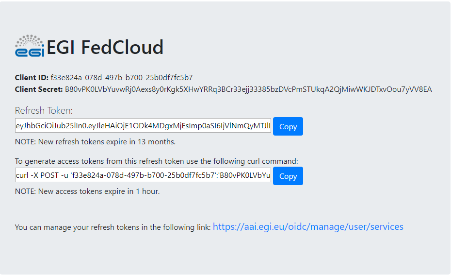

# Exercise no.04 - How to get an API access token via REST API

In this exercise we learn how to: 
* Get an Access Token via REST API to access Onedata.

You first need to use the EGI Check-In (e.g.: https://aai.egi.eu/fedcloud/) to generate a new OIDC Access Token.

Save `ClientID`, `Client Secret` and `Refresh Token` in the environment variables.

### Hands-on

In the Docker container open the Python console shell and do the following:

<pre>
$ python
Python 2.7.12 (default, Nov 12 2018, 14:36:49) 
[GCC 5.4.0 20160609] on linux2
Type "help", "copyright", "credits" or "license" for more information.
>>> 

>>> import requests
>>> client_id="insert your client id here"
>>> client_secret="insert your client secret here"
>>> refresh_token="insert your refresh token here"
</pre>

### Generate an OIDC Token from EGI Check-In

<pre>
>>> url = "https://aai.egi.eu/oidc/token"
>>> payload = {'client_id': client_id, 
>>>        'client_secret': client_secret,
>>>        'grant_type': 'refresh_token',
>>>        'refresh_token': refresh_token,
>>>        'scope': 'openid email profile'}

>>> curl = requests.post(url=url, 
>>>        auth=(client_id, client_secret), data=payload)

>>> if curl.status_code == 200:
>>>        data = curl.json()
>>>        #print ("[ Server response ]")
>>>        oidc_token=data["access_token"]
>>> else:
>>>        raise RuntimeError("Unable to get a valid OIDC token!")
</pre>

### Getting an API Access Token from ONEZONE_HOST

<pre>
>>> onezone_host="https://datahub.egi.eu"
>>> url = "%s/api/v3/onezone/user/client_tokens" %(onezone_host)

>>> headers = {'X-Auth-Token': 'egi:%s' %oidc_token,
>>>            'Content-type': 'application/json'}

>>> curl = requests.post(url=url, headers=headers)

>>> if curl.status_code == 200:
>>>        data = curl.json()
>>> else:
>>>        raise RuntimeError("Unable to get valid token!")

>>> data["token"]
</pre>

